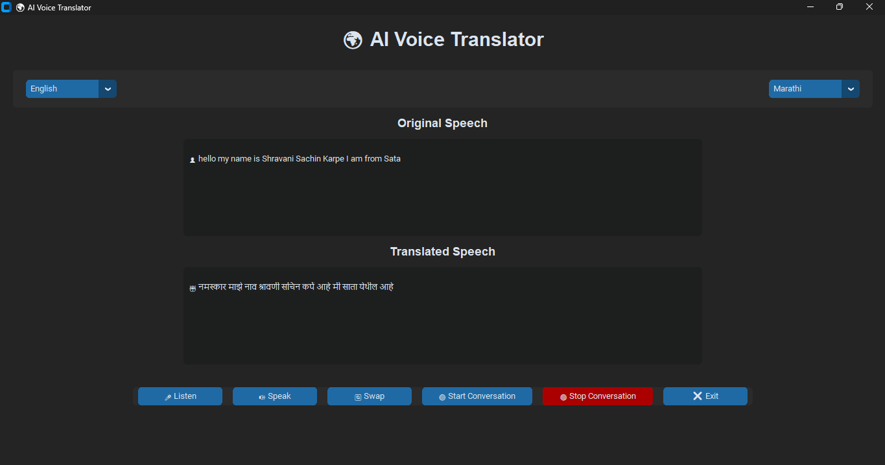

# 🌍 AI Voice Translator

An AI-powered desktop application that enables real-time voice translation between multiple languages.

## ✨ Features

- 🎤 Speech Recognition
- 🌍 Language Translation
- 🔊 Text-to-Speech
- 🔄 Language Swap
- 💬 Conversation Mode
- 🟢 Professional Status Bar
- 🖥️ Modern CustomTkinter Interface

## 📷 Screenshot

## 🛠️ Technologies Used

- Python
- CustomTkinter
- SpeechRecognition
- Deep Translator
- gTTS
- pygame

## 🚀 Future Goals

- Flutter Android App
- Live Voice Call Translation
- AI Context-Aware Translation
- Offline Translation

# Author
SHRAVANI SACHIN KARPE.